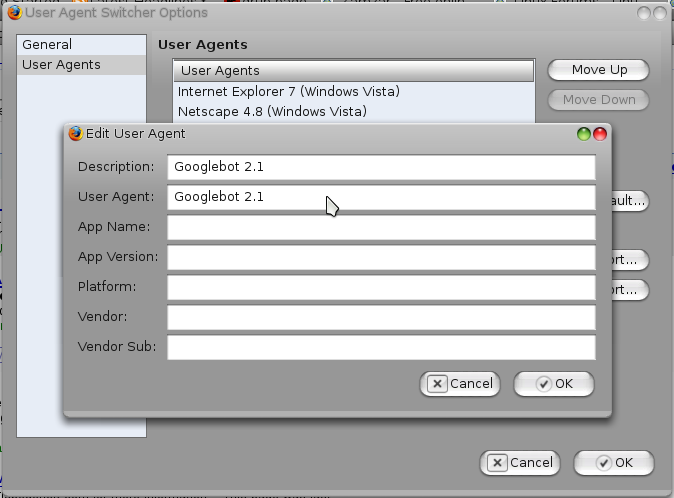

You just found a solution to your problem in google, but cannot view it because the site that requires you to be a registered user.

How do you bypass compulsory registrations to such sites?

Well, I used [bugmenot](http://www.bugmenot.com "BugMeNot") most of the times. But [bugmenot](http://www.bugmenot.com "BugMeNot") does not contain login for all sites (unless of course somebody posts it there) and some sites ban users whose login information is posted in [bugmenot](http://www.bugmenot.com "BugMeNot").

Solution:  
Use Google Cache.  
Most sites allow google bots to view and cache the page contents so that they get their content indexed in Google. You can view the page the by simply clicking Cached.

Image (Click to Enlarge): h4cky0u blocks Guests but welcomes Googlebot

What if Google cache doesn't have the item (or you cannot search for it) and simply want to browse the site as a Googlebot?  
You can make websites think that you are Googlebot. Use the [User Agent Switcher Firefox add-on](https://addons.mozilla.org/en-US/firefox/addon/59 "User Agent Switcher for Firefox") to change your useragent to Googlebot.  
To add a new agent, the Googlebot, navigate to Tools > User Agent Switcher > Options > Options and in User Agents, add a new User agent with description User Agent both set to Googlebot 2.1.

Image (Click to Enlarge): Add Googlebot user agent

When you encounter such a site you can try switching to Googlebot from the Tools > User Agent Switcher > Googlebot 1.2 to view the page. If the site administrator has allowed bots to browse the site to increase her Search Engine ranking, you can browse the site.

You may be tempted to keep the user agent as Googlebot permanently. However, it is recommended to keep the user agent to default unless of course you really need to change it Keeping the User Agent to other than your original browser settings will make it problematic for the sites to recognize your browser and your Operating System and you may not get proper content.

Comments and other workarounds are welcome.
