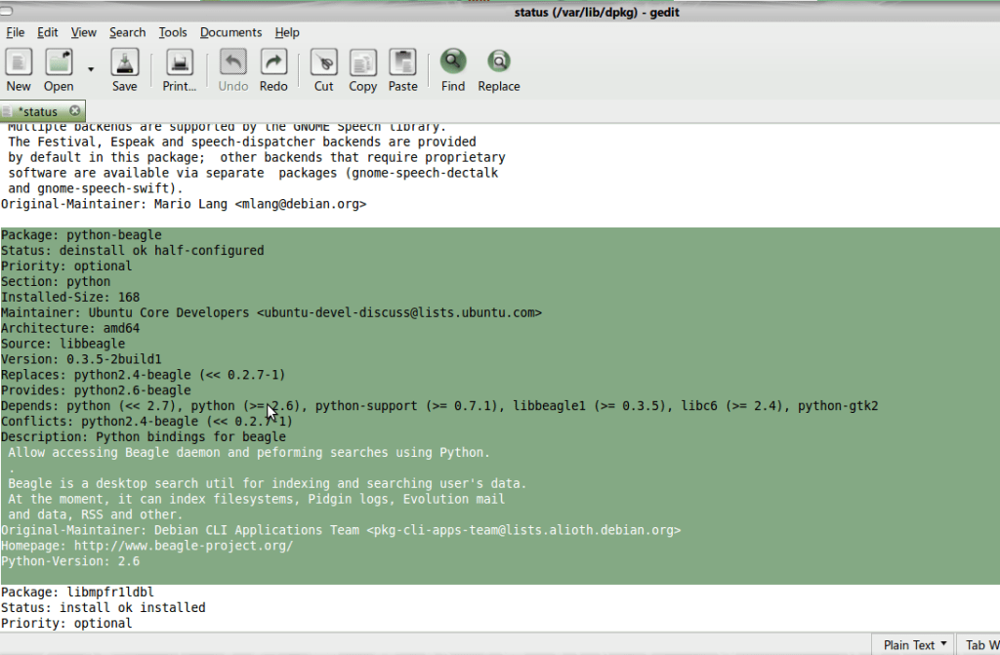
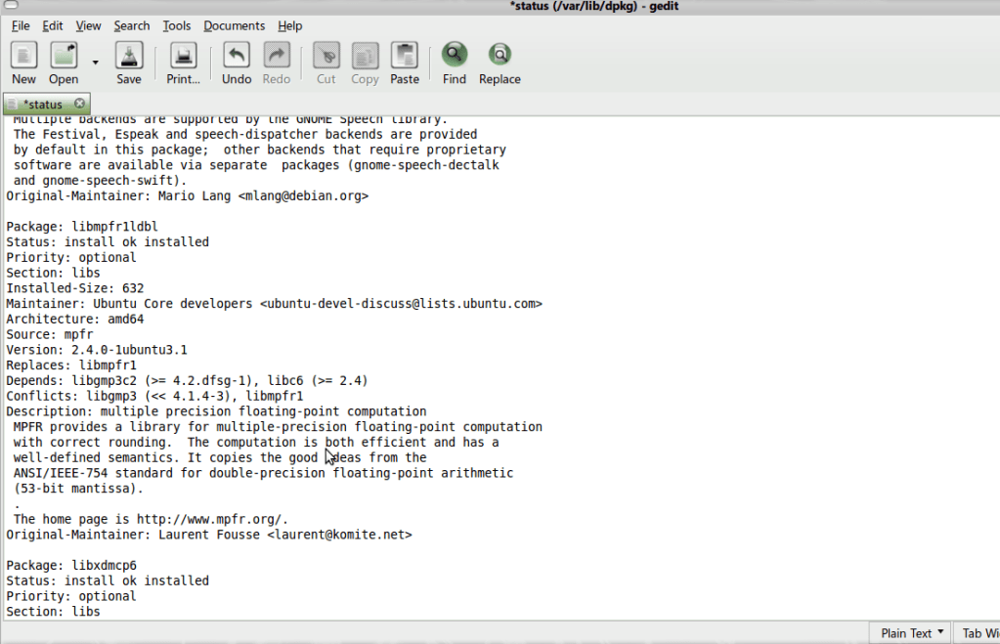

Recently, I encountered a package management related error in Ubuntu Jaunty Jackalope 64bit.

The package was python-beagle and the error was: "E: python-beagle: subprocess pre-removal script returned error exit status 2" and details showed:

> dpkg (subprocess): unable to execute pre-removal script: Exec format error  
> dpkg: error processing python-beagle (--remove):  
> subprocess pre-removal script returned error exit status 2  
> dpkg (subprocess): unable to execute post-installation script: Exec format error  
> dpkg: error while cleaning up:  
> subprocess post-installation script returned error exit status 2  
> Errors were encountered while processing:  
> python-beagle  
> E: Sub-process /usr/bin/dpkg returned an error code (1)

I managed to fix it. Read on for how I did it.

Precaution: The process can break your system if not followed as mentioned (you may get into problems even if you follow the process). Please proceed at your own risk.

First, please try the following in terminal:

sudo aptitude update
sudo aptitude -f install

If it does not work, then you may want to try:

sudo dpkg --force all --remove

If both of them still produce similar errors, then continue. If the above commands fix your problem, you should not continue.

1\. Close Synaptic or any package manager. Wait for or cancel any updates or installuninstall.  
2\. Make Backups of current /var/lib/dpkg/status file. Just copy and paste to your home directory or Desktop.  
3\. Alt+F2 and launch type in gksu gedit /var/lib/dpkg/status and run it. Gedit will be launched with a text file open.  
4\. Now, search for the exact name of the package with problems and find it.  
5\. In my case, it I found the entry for the package python-beagle:

Package: python-beagle
Status: deinstall ok half-configured
Priority: optional
Section: python
Installed-Size: 168
Maintainer: Ubuntu Core Developers
Architecture: amd64
Source: libbeagle
Version: 0.3.5-2build1
Replaces: python2.4-beagle (<< 0.2.7-1)
Provides: python2.6-beagle
Depends: python (<< 2.7), python (>= 2.6), python-support (>= 0.7.1), libbeagle1 (>= 0.3.5), libc6 (>= 2.4), python-gtk2
Conflicts: python2.4-beagle (<< 0.2.7-1)
Description: Python bindings for beagle
Allow accessing Beagle daemon and peforming searches using Python.

6\. Select and delete that information and that much information only, i.e. you will remove "Package: culprit-package-name" to "Description: culprit package description". Remmber, "culprit package description" may be multiline and you will need to remove all the lines till a blank line. Don't forget to leave a line blank between the package description above and the one below. To clarify things out, I have placed the images here, pelase have a look. Here the package to be removed is python-beagle.

Before Deletion

Selection

After

7\. Launch Synaptic (or any package manager) and then search for package. You will see the package as not installed. Mark it for installation and install it. If you start to see the same error, restart the same process from Step 1 but the next time, stop at step 6. 
8\. Now, you should be able to remove it if you no longer want the package. If you can't, restart the same process from Step 1 but the next time, stop at step 6.

Hope this was helpful. Please post in comments.
