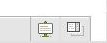

If you use Konqueror and use Facebook, you might have noticed that Chat Window does not show up as normal and opens in a new window. In firefox or other supported browsers, you will see chat icon as this one:

Firefox Facebook Chat

If you click on that one, you will be able to chat normally.

However, when you use Konqueror or other unsupported browser, you might see something like this one:

Konwueror Facebook Chat

If you click on this however, the chat will open in a new window.

To fix this, all you need to do is change the Browser Identification of Konqueror to Firefox for Facebook. This is how you do it. In Konqueror, go to Settings > Configure Konqueror Browser Identification and then in Site Specific Identification, click on new and then fill in the following information:  
When Browsing the Following Site: facebook.com  
Use the Following Identification: Firefox 3.0.5 (or any other Firefox version available)  
Real Identification: (Leave as it changes automatically)  
Here is what it should look like:

Facebook Chat Opens in a new window Fix (Click to Enlarge)

Now, it should work as normal.

Hope this helped.
