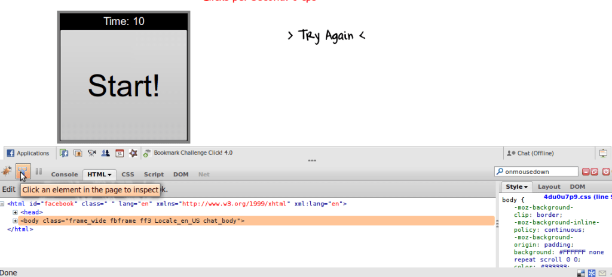

I use Facebook a lot and recently I came across a few games that use Javascript and are Click Challenges. They are Challenge Click (mychallengeclick) , Impossible Click Final (o\_myclick). They can simply be tricked by modifying JavaScripts using Firebug. So here is what you need:  
Firefox  
Firebug Plugin for Firefox  
I am using Firefox 3.5.5 and Firebug 1.4.5 but other versions should work just fine.

Here is how you proceed with the hack. I will show you how to trick Challenge Click (mychallengeclick), however, you can use a similar method to hack Impossible Click Final (o\_myclick) (and anything similar as well). I'll assume you have installed Firefox and Firebug already.  
Open the Application: http://apps.facebook.com/mychallengeclick/  
Now, activate Firebug by clicking the icon in the status bar.  
Click the inspect button on the top right corner of Firebug. Here is what inspect looks like in my PC.

Facebook Hack Challenge Click (Click to Enlarge)

That logo may look different in your OS, Firebug. Now, click on the "Start" and it should highlight the following code in the Firebug Pane below.

Now, click on onmousedown and change it to onmouseover. Now change the onmouseover action

fbjs\_sandbox.instances.a184094167325.bootstrap();return fbjs\_dom.eventHandler.call(\[fbjs\_dom.get\_instance(this,184094167325),function(a184094167325\_event) {a184094167325\_click()},184094167325\],new fbjs\_event(event));

to

for(i=0;i<1211;i++) { fbjs\_sandbox.instances.a184094167325.bootstrap();fbjs\_dom.eventHandler.call(\[fbjs\_dom.get\_instance(this,184094167325),function(a184094167325\_event) {a184094167325\_click()},184094167325\],new fbjs\_event(event));}

or something similar. All I have done is surrounded the code inside a for loop which loops 1211 times (you may choose any other value to your liking) and removed "return" otherwise the loop will not execute.  
  
Now, just move your mouse over the start button and voila. Your points should sky-rocket. Publish and annoy your friends.

Hope you like it.
