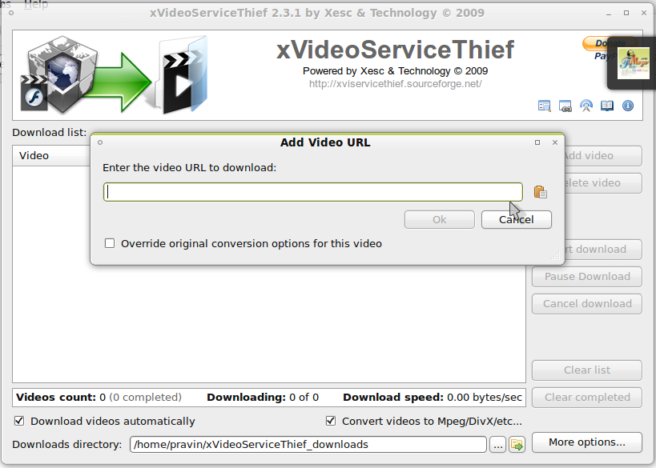

xVideoServiceThief is a Desktop based video downloader for Linux, Windows and Mac. It is capable of downloading videos from Youtube, Google, Yahoo and various other sites. You can even queue the videos and it downloads with resume support (if the server supports it). It can resume Youtube videos.

It can be downloaded from:  
[http://xviservicethief.sourceforge.net/index.php?action=downloads#Linux](http://xviservicethief.sourceforge.net/index.php?action=downloads#Linux)

To install it in Ubuntu, all you need to do is extract it and run install.sh (double click and "Run in Terminal" or open terminal and execute ./install.sh). It will be installed to your home directory (eg /home/khattam/xVideoServiceThief). To run it, just double click the xvst executible. If it fails to run, make sure you have installed libqt4.

Hope this helps.
