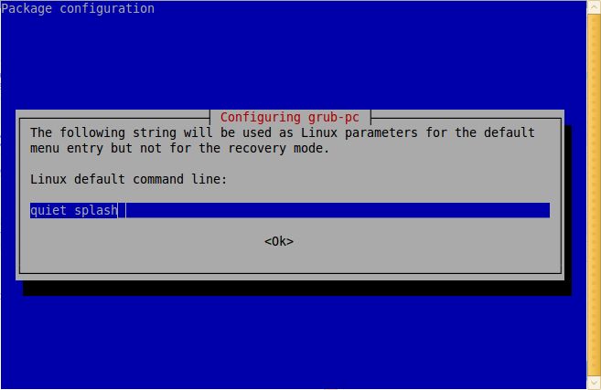

I am using Ubuntu 10.04 Lucid Lynx Alpha on a system with Gigabyte GA-G31M-S2L with Intel GMA 3100 onboard graphics. I upgraded to Lucid from Karmic Koala (9.10) and it was always showing these errors on boot:  
"error: mountall Could not Connect to Plymouth"  
"mountall main process (x) terminated with status 1"  
Also, I could not experience Plymouth. I thought it was a problem with Plymouth and believed updates will fix it, but that did not happen till date. Today, I decided to fix it and went looking around for a fix and got it working.  
  
I found [this thread](http://ubuntuforums.org/showthread.php?t=1357117) on [Ubuntu Forums](http://ubuntuforums.org/) and was able to fix it by following it.  
I checked by boot options and noticed that there was only "quiet" specified, and no "splash". I added "splash" and it worked.

For that, I just had to do the following:  
(Please continue at your own risk)  
Launched the terminal (Accessories > Terminal) and typed in sudo dpkg-reconfigure grub-pc. I left the linux command line field empty and hit enter.  
In Linux default command line, there was "quiet" already. So I added "splash"(without quotes) after a space.  

  
Then I pressed enter and again enter. I chose the default in Grub Install Devices and pressed enter again.  
It gave me:

Installation finished. No error reported.

and then generated grub.cfg.

Then, I typed in

sudo plymouth-set-default-theme --list

and pressed enter. It gives a list of installed themes for plymouth. To set, you can use

sudo plymouth-set-default-theme THEME\_NAME --rebuild-initrd

where THEME\_NAME is the one listed by the previous command. I chose solar by typing in:

sudo plymouth-set-default-theme solar --rebuild-initrd

and rebooted. I could see plymouth now. The solar theme looks great.

Your graphics card may not be compatible with Plymouth, so don't expect it to work, not so early. I hope it supports yours in later developments.

UPDATE March 29: When I upgraded my system, the kernel was updated to 2.6.32-16 and the same error started appearing again. It was working fine (and still does) with kernel 2.6.32-15. Hope they fix it in the next kernel build. I am getting this with Plymouth 0.8.1-1ubuntu1

UPDATE March 30: Kernel updated to 2.6.32-18 and Plymouth to 0.8.1-1ubuntu3 but the problem still persists. Please follow [bug 551062](https://bugs.launchpad.net/ubuntu/+source/plymouth/+bug/551062) at Launchpad to find out when it is solved.

Please share your Plymouth experience.
