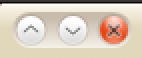

I am using Ubuntu 10.04 Lucid Lynx in my PC. The Ubuntu Design Team has decided to move the Minimize, Maximize and Close buttons to the left of the title bar. Not exactly like Mac OS X, which looks like the following:

while Ubuntu button layout is as follows:

Maximize, Minimize, Close in Ubuntu Lucid

The difference is the order in which they appear.

UPDATE April 2: The button order in Lucid will now follow Mac OS X style.  

The head of Ubuntu Design Team [does not give out any particular reasons for that](http://www.ivankamajic.com/?p=281) and Mark Shuttleworth says he wants to use the right part for something else, probably in the 10.10 release.

I agree that moving that to the right might have some benefits as it takes less mouse movement to get there rather than the right side, but I am always looking for one of those on the right side, because of my habit. So, I decided to move it to the right for now, but I may consider switching to the left to see how it works for me.

To move it back to the right, you will need to launch Configuration Editor (Alt+F2 and type in gconf-editor) and then navigate to apps>metacity>general. Look for button\_layout on the right hand pane and double click on it to edit it. You should change it from

maximize,minimize,close:

to

menu:minimize,maximize,close

. This should do it.

Alternately, this can also be done by executing the following command from the terminal or from the Run Application Dialog (Alt+F2):

gconftool-2 --set /apps/metacity/general/button\_layout --type string menu:minimize,maximize,close

Thanks to Jack H. for posting this in the comments below.

Please share your views about the new button layout.
