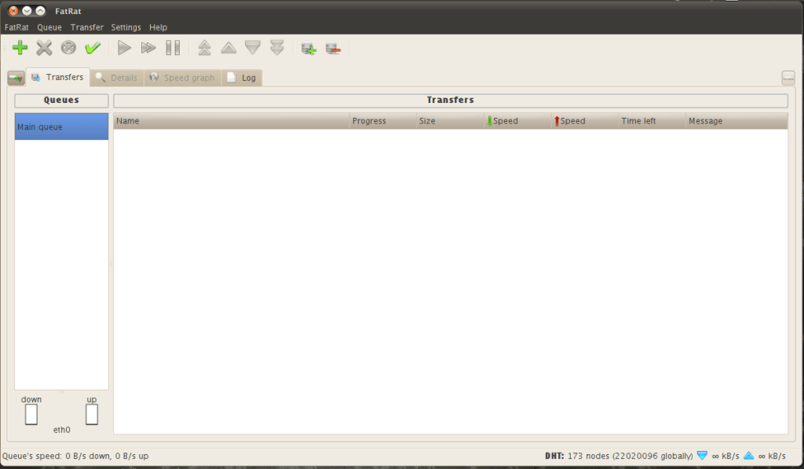
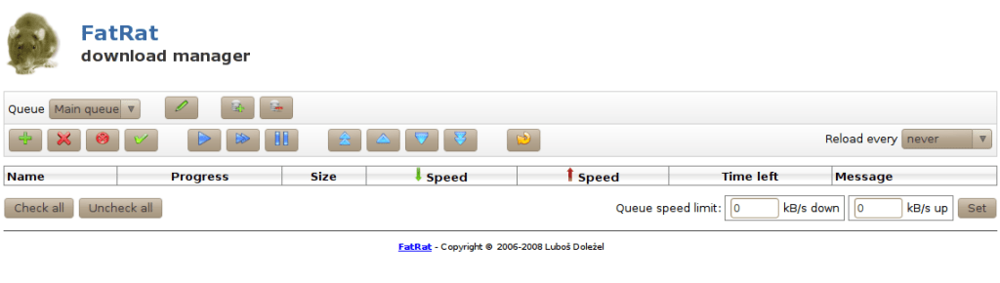
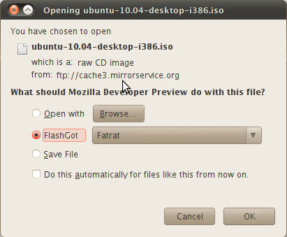

I am using Ubuntu 10.10 Maverick Meerkat and had been using the following programs for downloading stuff from the Internet:

Firefox Default Download Manager for HTTP/FTP Downloads and Deluge for Torrents.

It was not much convenient because Firefox resume does not always work in case of crashes or in case of power cuts. Also it does not support multi-threaded downloads. So, I decided to try out Fatrat along with Flashgot firefox add-on. Fatrat and Flashgot both can be installed from Ubuntu Software Center. If you are using beta or development version of Firefox, then you need to get it from Firefox Addons Website or [Flashgot website](http://flashgot.net/).

Fatrat, like Free Download Manager (which is currently only available for Windows), can be used as a torrent client, HTTP/FTP Download Manager, Rapidshare download (it waits for appropriate time automatically and downloads), Youtube Download (at the time of writing this, Youtube download seems not to be working) and much more.  

  
It supports remote control via jabber and web interface.  

  
Since Flashgot does not support Fatrat by default, you will need to add support for Fatrat. When it asks for path, enter /usr/bin/fatrat. After that, you can select and right click a link and Flashgot it. You can also select Flashgot>Fatrat when the download box comes up.

  
When you click OK, Fatrat should show the add link dialog.

Have fun downloading.
