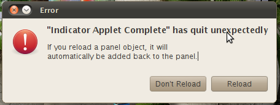

UPDATE: This has been fixed in yesterday’s update.

I’m using Ubuntu 10.10 Maverick Meerkat Alpha. The indicator-sound applet was recently updated to version 0.3.9 and every time a track changes, the following error shows up:

> **“Indicator Applet Complete” has quit unexpectedly**
> 
> If you reload a panel object, it will automatically be added back to the panel.

A bug report has been filed here and hopefully gets fixed in the next release. However, I have temporarily fixed the issue for now by downgrading to indicator-sound v3.8. I could not find the version online but I could find it in my package cache by the following command:

find /var/cache/apt/archives| grep -i indicator-sound

I just installed the last version by running the following:

sudo dpkg -i /var/cache/apt/archives/indicator-sound\_0.3.8-0ubuntu1\_amd64.deb

If you don’t have that version, slightly older version should do just fine.
