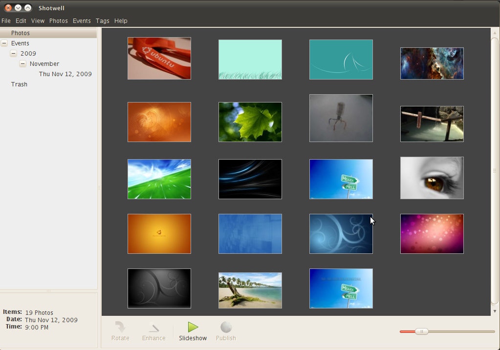
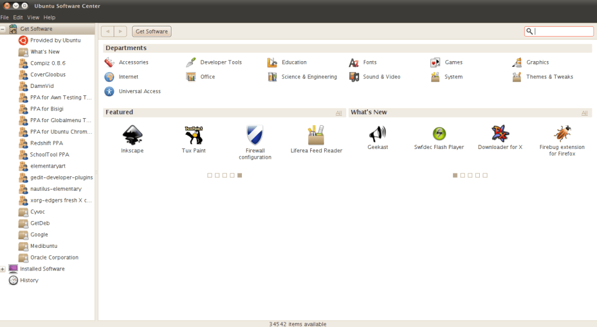
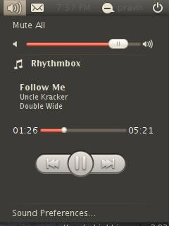
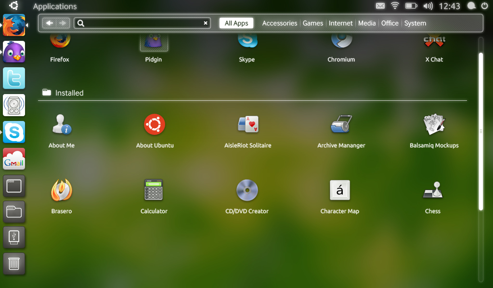
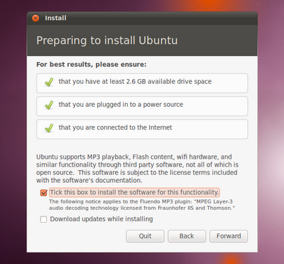

UPDATE: Ubuntu Maverick Meerkat Beta has been released.

Ubuntu 10.10 Maverick Meerkat has been scheduled to be released 10 October 2010 (10/10/10) and most of the changes have been already implemented as it is heading for the 3rd Alpha release in August 5th. GNOME Shell and GNOME 3 will not make it to Ubuntu 10.10 as it was initially expected. Also, the default theme seems to be same as Lucid. However, there are going to be some changes in this version. Some of them are:

**Shotwell**  

Shotwell will be the default photo manager replacing F-Spot. It is a lot neat and has better interface than F-spot.

**Ubuntu Software Center**  
There will be changes in the usability and appearance of Ubuntu Software Center. It will feature “What’s new” section which will show the latest softwares. It now also has nice animation effects and better appearance and constantly changing with each update.

  
It will also feature a paid apps section where the user will be able to buy applications for Ubuntu.

**Rhythmbox and Sound Applet**  
Rhythmbox will remain the default audio player but it will have feature enhancements. It will have link sharing button which lets you share about the track in social networking sites and more feature enhancements are in progress. Also, the sound applet will feature per application sound and controls for selected applications. This lets you to control rhythmbox right from the sound applet.  

  
The above picture shows the progress till Alpha 2. There is still work to be done though.

**Aptitude**  
If you used aptitude to install programs from the command line, you will no longer be able to do so because aptitude is being removed from the default desktop installation. You will need to use it from software center (or synaptic or apt-get) if you wish to use it.

**Unity Interface**  
Unity features a launcher appearing in the left side of the Ubuntu Network Edition desktop.  

  
Ubuntu Netbook Edition will feature Global Menu, at the top (similar to Mac OS X), which is supposed to save desktop space.  
Not only does it look awesome, it should also improve usability of UNE.

**Chromium**  
Firefox 3.x will remain the default browser in Ubuntu Netbook Edition. It was announced earlier that Chromium would be replacing Firefox, but recently, they have decided to stick with Firefox.

**BTRFS (B-tree FileSystem)**  
A new file-system called BTRFS (Butter FS), that was added to Linux kernel 2.6.29-rc1 for testing, has made it to Ubuntu installer as well. However, stable release of BTRFS is still pending, this file system offers pooling, snapshots, checksums and integral multi-device spanning that other Linux file systems fail to deliver. This will be available as optional file system in the installation wizard as an optional file system.  
UPDATE: BTRFS support may only be available in Natty (Ubuntu 11.04)

**Compiz**  
There are minor changes in default set of animations for Compiz which makes the desktop experience better.

**Installer Changes**  
Ubuntu installer has been revamped. It has become even better and easier. It asks if you want to install MP3 support during the installation.  

**Multi touch**  
Ubuntu Maverick will feature multi touch support. See videos [here](http://www.webupd8.org/2010/08/ubuntu-multi-touch-videos-evince-and.html).

Since Maverick is still undergoing development, certain elements might be changed. I will keep you updated about the changes.
