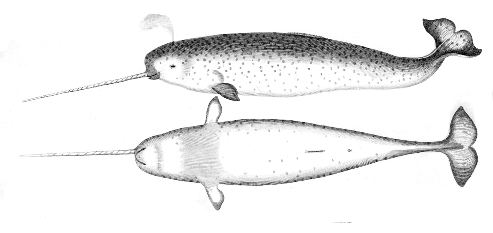

Mark Shuttleworth mentioned in his blog that the new Ubuntu after Maverick Meerkat 10.10 will be named Natty Narwhal.

Here is what he writes in his [blog](http://www.markshuttleworth.com/archives/478):

> So the Narwhal, as the closest thing to a real live unicorn, is an auspicious figurehead as we lay down the fabric from which dreams will be woven. Dreams of someone’s first PC, dreams of someone’s first million instances in the cloud: whatever your vision of the future, we hope the Natty Narwhal will have something to offer.

Lets hope Natty will make Linux user's dream come true.
