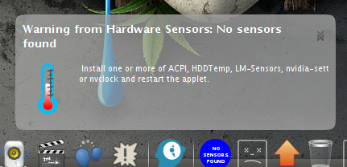

If you add Hardware-sensors applet to avant-window-navigator panel, you will get the following warning if you have not set up hardware sensors and the sensor will not work. It will tell you "NO SENSORS FOUND" and give the warning:

> **Warning from Hardware Sensors: No sensors found**  
> Install one or more of ACPI, HDDTemp, LM-Sensors, nvidia-sett or nvclock and restart the applet

Here is the screen shot of what it looks like:

To install and setup sensors, just run the following commands:  
**HDDTemp**

sudo apt-get install hddtemp

When it asks you, choose to run its daemon.  
**LM-Sensors**

sudo apt-get install lm-sensors
sudo sensors-detect

You can choose default options (just press Enter) for all of them except when it asks the following:

> Do you want to add these lines automatically to /etc/modules? (yes/NO)

Answer yes to that question. Now run the following:

sudo /etc/init.d/module-init-tools start

Now, just restart avant-window-navigator:

killall avant-window-navigator
avant-window-navigator
