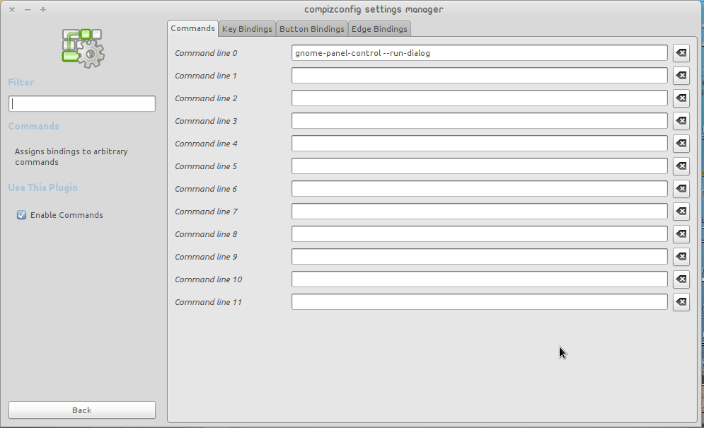

UPDATE: I figured the problem was due to messed up compiz settings. Disabling and enabling compiz (Right Click on Desktop>Change Desktop Background>Visual Effects None and then again to Normal or Extra) fixed it.  
The older post follows.

I am using Ubuntu 10.10 Maverick Meerkat 32bit. After a few updates and package changes, the run application dialog mysteriously stopped working. I had to do a little compiz workaround to make it work. To start, install Openbox for the tool "gnome-panel-control ". Use Software Center or Synaptic Package Manager or just the command line:

sudo apt-get install openbox

Once it is installed, run dialog can be brought up by running:

gnome-panel-control --run-dialog

Now, lets associate this with Alt+F2 with the help of Compiz Config Settings Manager(CCSM). To do so, CCSM must be installed:

 sudo apt-get install compizconfig-settings-manager

Then, just open it: System>Preferences>CompizConfig Settings Manager. Then enable "Commands" plugin and in the plugin prefernces, under "Command" tab, enter the following in any Command Line X (where X =0, 1, 2 ...) as shown below:

gnome-panel-control --run-dialog

Now, goto the "Keybindings" tab and then in the respective "Run Command X", click the "Disabled" button and "Enable" it. Then, click "Grab Key Combination" button and press Alt+F2. Close it and now Alt+F2 should work normally.

Hope this helps.
