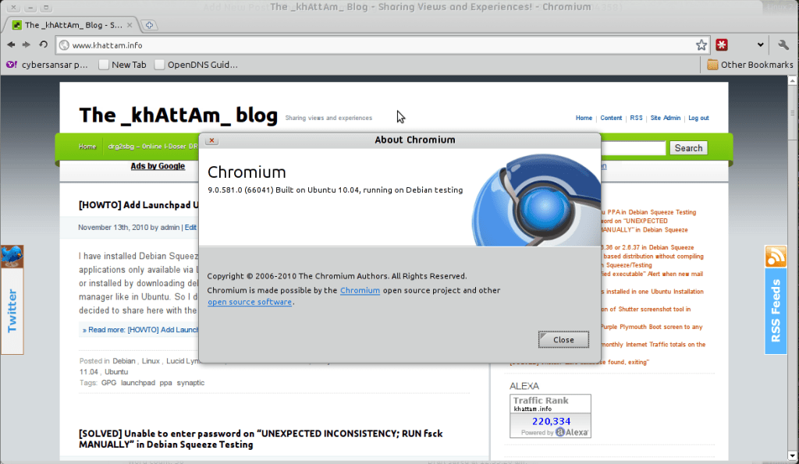

As I mentioned in my previous post, you can [install software from Ubuntu Lucid Lynx PPA to Debian Squeeze Testing](http://www.khattam.info/howto-add-launchpad-ubuntu-ppa-in-debian-squeeze-testing-2010-11-13.html). Using the same method, Chromium v9 can be installed in Debian Squeeze using the [Ubuntu Chromium Daily PPA](https://launchpad.net/~chromium-daily/+archive/ppa).

In Synaptic Package Manager, navigate to Settings>Repositories>Third Party Sources and then add the following:

deb http://ppa.launchpad.net/chromium-daily/ppa/ubuntu lucid main 

Open up the terminal and type in the following as root (type in "su", press ENTER and enter root password to change to root first or enable sudo in Debian and use sudo instead):

apt-key adv --keyserver keyserver.ubuntu.com --recv-keys 4E5E17B5
