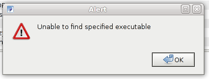

I recently installed Icedove in my Debian Desktop and I got an alert box saying "Unable to find specified executable".

  
I had preserved the profile from previous installation (Thunderbird) and the add-on Gnome Integration was installed in my older installation which was automatically carried over to my new installation. I do not have Gnome currently installed in my system and I do not have the necessary binary (/usr/bin/notify-send) for the add-on to use.

To solve this, one of the two solutions can be used.

**Remove Gnome Integration**  
If you do not have Gnome installed, it makes more sense to uninstall the Gnome-Integration add-on from Tools>Addons in Icedove/Thunderbird. Restart Thunderbird/Icedove and the alert should not appear anymore.

**OR**

**Install libnotify-bin from package manager**  
If you are using Debian or similar system, you will find a package called libnotify-bin in Package Manager or install it from terminal.

sudo apt-get install libnotify-bin

Note: if you have not configured your system to allow you to _sudo_, but you want to be able to, [read this article](http://www.khattam.info/howto-enable-ubuntu-like-sudo-in-debian-squeeze-2010-11-14.html). Otherwise run it as root by using su.  
After installing it the alert will probably not appear anymore.
