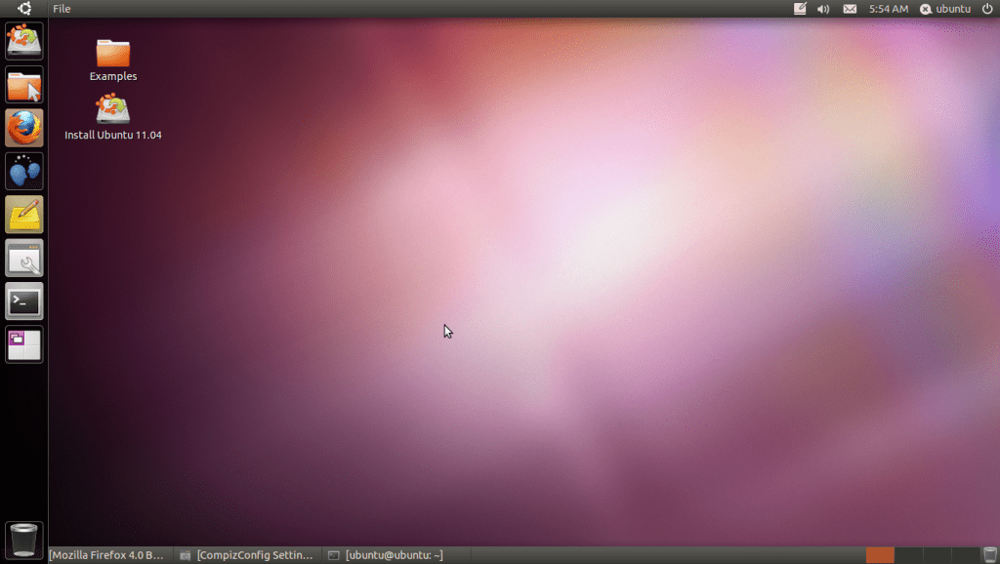
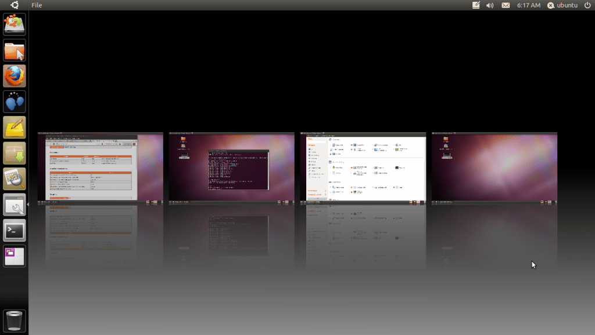
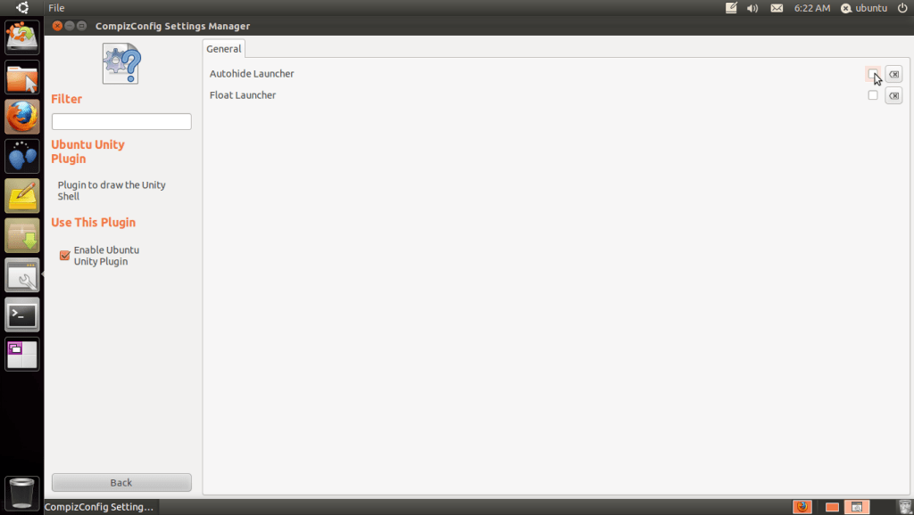
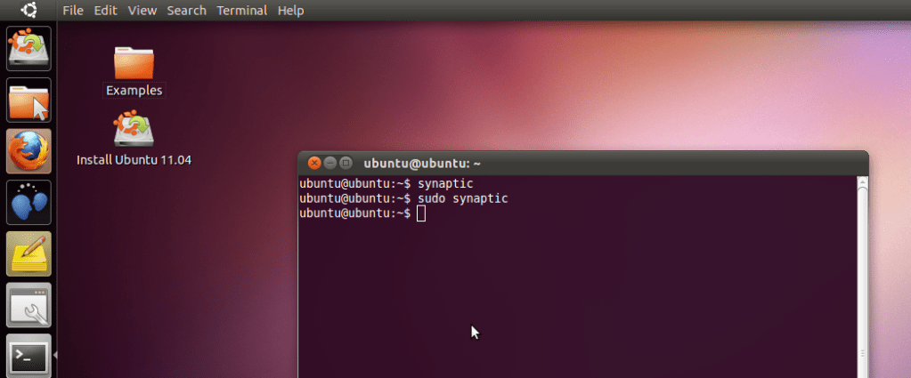

I just used zsync to download the latest daily build of Ubuntu 11.04 Natty Narwhal. It features Ubuntu Unity Plugin for Compiz among other changes.

Compiz version is 0.9.2 and it features several plugins by default for functionality and effects. However, extra plugins are not available in current repository (0.8.6 version is available, which breaks 0.9.2)

Clicking the Workspace Switcher icon on Unity brings up Expo interface and it is easy to switch to another workspace and move windows between workspaces.

You can enable autohide in Unity by installing compizconfig-settings-manager:

sudo apt-get install compizconfig-settings-manager

After it is installed, you can launch it by pressing Alt+F2 to bring up the Run Application Dialog and then typing in ccsm.

The hidden unity dock can be brought back by putting mouse over the Ubuntu icon in the top left corner.

It also features a global menu (indicator-appmenu) which removes the menu bar from the applications and puts it up on the top panel. The menu shown is the menu of the application in focus. This feature is similar to Mac OS X. However, only GTK Applications are supported currently. This means, Openoffice and Firefox are not supported till date.

The current interface lacks an easy way to launch applications (it has to be done via Alt+F2 if compiz is enabled), compiz crashes a lot, sometimes when opening up Appearance Preferences, sometimes when changing compiz settings and sometimes just while doing something arbitrary.

Currently compiz in Natty is far from being perfect, but this is quite some change considering the fact that even the final relase is scheduled in April 28, 2011. The first alpha however, should arrive shortly and hope we see something better.
