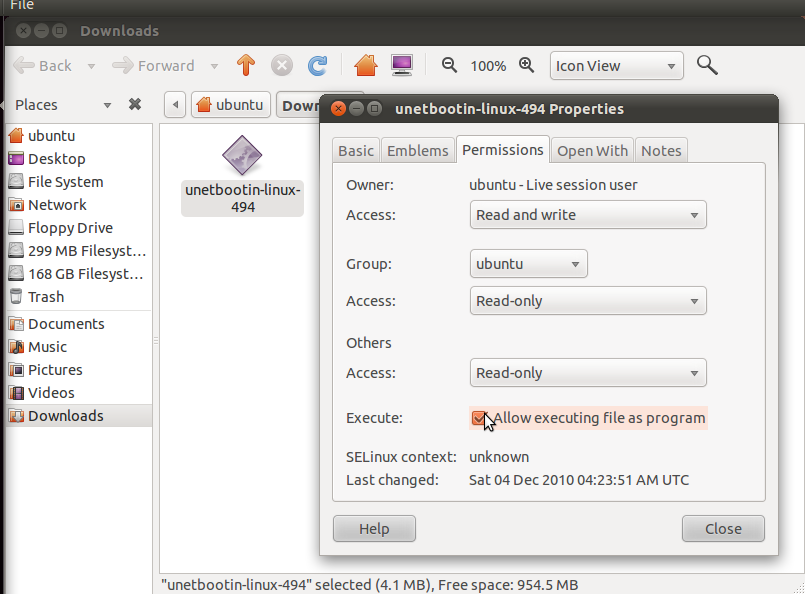
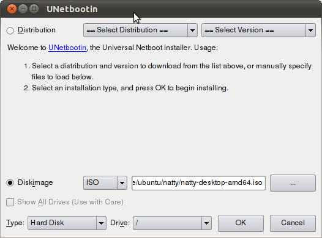

If you are keen about the changes in the next version of Ubuntu, 11.04 (Natty Narwhal), and want first hand experience, you can setup your own live testing environment which boots right from the harddisk. You can of course test the ISOs in Virtualbox, but if your card is not supported for Virtualbox 3D, you won't be able to test the new Ubuntu Unity interface.

**Requirements**  
Computer running Linux with Internet Access  
The computer must have graphics card supported by default by Ubuntu

**Assumptions**  
I am assuming you are running another copy of Ubuntu. If the instructions don't actually fit with your system, feel free to do whatever applies to your distro.

**Getting the latest CD Images**  
Ubuntu 11.04 Natty Narwhal is under heavy development. The CD images are updated daily for users and developers to test. They are available [here](http://cdimage.ubuntu.com/daily-live/current/). However, if you download full ISO images daily, you will be wasting a lot of data transfer and time. Instead, you can download the changes only using zsync. Here is how.

Open up the terminal and install zsync:

sudo apt-get install zsync

Now, go to the [daily images](http://cdimage.ubuntu.com/daily-live/current/) page and look for .zsync files of the ISO you want to try. For instance, if you want to try Ubuntu 11.04 32bit, you will need the zsync file natty-desktop-i386.iso.zsync. Don't download the zsync file though. You will just need the URL to the zsync file. To get that on Firefox, right click and click "Copy Link Location".

Now, you will need a directory where you want to download the images. Create a directory and make sure about 2 GB of space is available in the drive. Then, just open up the terminal and change to that directory and type in the following:

zsync http://cdimage.ubuntu.com/daily-live/current/natty-desktop-X.iso.zsync

where X is one of amd64+mac, amd64, i386, powerpc+ps3 or powerpc.  
(The second part of the above command is the link you copied in the above step.)

Now, whenever you wish to get the latest Ubuntu ISO image, just run the same command from the same directory and your ISO will be updated. zsync will download only the changed parts from the server and the download will require less data transfer and hence will be faster.

**Setting it up to boot**  
When you have the latest ISO, you will need to test them by booting. As I mentioned earlier, you could use Virtualbox but it may not support your graphics card for 3D and hence testing Unity may not be possible. Another program you can use is "Startup Disk Creator" (also known as usb-creator-gtk), but it only lets you create USB disks. If you have USB disks and don't mind writing lots of files to it on a daily basis (assuming you will be testing all the daily builds), you could use that. However, USB Flash drives are prone to failure if used in that way.  
The program we are going to use is unetbootin. It allows you to setup booting ISOs right from the Harddisk. It is available in the repositories in most Linux distributions but the latest version may not have hit the repositories yet, so it is recommended to download it from the [official page](http://unetbootin.sourceforge.net/). But it is recommended to install the one from your repositories too so that the dependencies are installed.

Make it executable by doing a chmod +x or by right clicking the downloaded file and selecting properties and checking the "Allow executing file as program" in Permissions tab.  

  
Now, launch unetbootin and select the DiskImage option (and not the distribution) and browse to locate the latest daily ISO you downloaded using zsync. Select Type as Hard Disk and Drive as / and click OK.  

  
When done, reboot and hold on Shift when the computer just starts to bring up the Grub menu. In the Grub menu, select the "Unetbootin" entry (and not the other ones, they may not work).

To setup the latest downloaded ISO again, run Unetbootin and uninstall the existing entry and repeat the same process.

Note: If you are using this setup, skip any updates to grub.

Happy testing.
