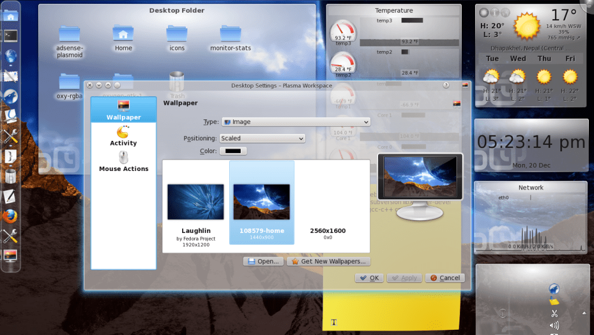

Oxygen-transparent is a modification of KDE Oxygen-style to add cool transparency. It was supposed to be merged to KDE 4.6, but the idea has been dropped due to issues with the theme. However, it can be installed in KDE 4.5 and 4.6 currently. I am using KDE 4.5 in Fedora 14 and here is how I got it installed.

However, before installing, do note [what the developer has to say](http://kde-look.org/content/show.php/oxygen-transparent?content=127752):  
\- this will erase your current oxygen installation;  
\- this will likely be erased by any future update of oxygen by your distribution packages;  
\- again, this is experimental

Having said that, lets continue.

**Installing Build Dependencies**  
Run the following command as root to install build dependencies. To run as root, type "su" followed by your password and then enter the following.

yum install kdebase-workspace-devel kdelibs-devel subversion libXrender-devel libX11-devel gcc-c++ cmake gcc wget

**Getting The Helper Script**  
To make the installation easy developer HugoPereira has written a script available at [KDE-Look.org](http://kde-look.org/content/show.php/oxygen-transparent?content=127752). Download and save the script to an empty directory and make it executable.

To download the currently available version of the script, you can run the following commands:

mkdir /tmp/oxygen-transparent
cd /tmp/oxygen-transparent
wget http://kde-look.org/CONTENT/content-files/127752-oxygen-setup.pl --output-document=oxygen-setup.pl
chmod +x oxygen-setup.pl

**Running The Helper Script**  
You can run the helper script (as root or any normal user) by typing in the following:

./oxygen-setup

The script will download the latest sources from svn, then runs cmake and compiles the code locally.

If the compilation is successful, you should get a mesage:

> \--- done
> 
> type "cd build; make install" (as root, or using sudo) to install.  
> report problems to "hugo\[at-the-rate\]oxygen-icons.org".

Run the following as root and the new theme should be installed:

cd build; make install

That should install the modified oxygen theme.

Log out and log back in to see the changes in effect. Also, after logging back in, you can configure the theme by running oxygen-settings (Alt+F2 and type in oxygen-settings). Open up "System Settings"> "Application Appearance" and press "Configure" to adjust transparency values.

Hope this helps.
