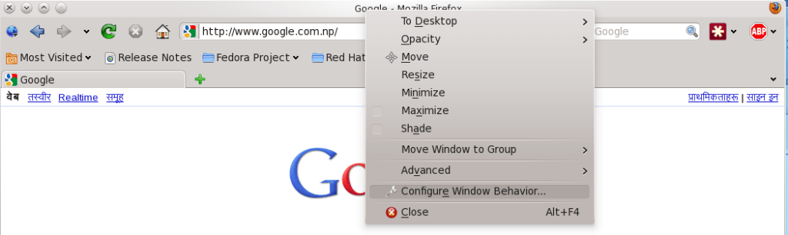
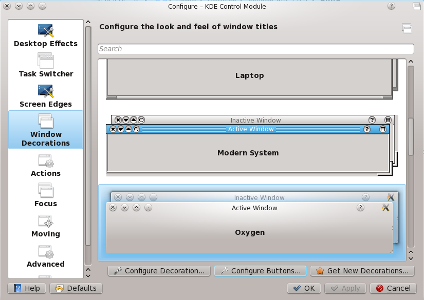
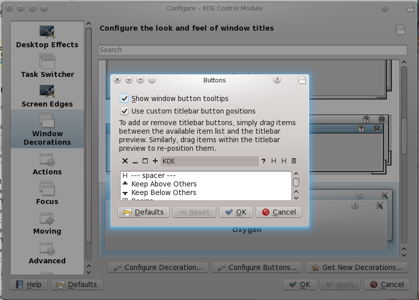

I have used Ubuntu Lucid since its early alpha stages to the final and then continued using it until lately. I am used to having title bar control buttons (i.e. maximize, minimize, close) on the left side of the window. I recently moved to Fedora 14 KDE Edition and was having problems with the control buttons. So, I moved them to the left. Here is how it is done.

Right click on the title bar and select "Configure Window Behaviour".  

Click on "Window Decorations" in the left pane.  

Click on "Configure Buttons" and you should see your current title structure. Drag around to get the following configuration.  

Hope this helps.
