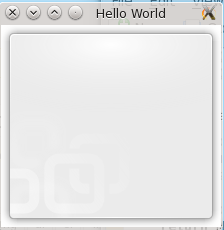
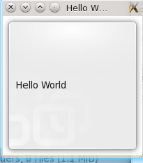

I am new to KDE and I have come to like the plasmoids on the Desktop. They can be used to display information (eg. Weather, Time, News) or can be used to carry out some tasks (upload images/text to web, check mail etc) easily.

I don't have any experience of Plasmoid development. I have decided to learn to write Plasmoids. I have moderate knowledge of Python.. I am learning Plasmoid development in Python and will be posting my experience. Feel free to learn with me or correct me if I am wrong.

I will be using Fedora 14 with KDE 4.5 for all my development and testing. However, other distros with any sub-version of KDE 4 should work fine. I will be citing all the references and where you can learn more.

I will be using Kwrite and KDevelop to develop plasmoids. However, you can pick any editor of choice.

For Hello World plasmoid, create a directory called hello anywhere you want. Also, create the following directory structure inside hello:

hello/
├── contents
│   └── code

The directory structure must be as shown above. or the plasmoid will not work.

Now, we will need a metadata for the plasmoid. This metadata file will contain the name, version, author-name, type of plasmoids and other information about the plasmoid. It should be inside the plasmoid directory (i.e. inside hello in this case). Here is my sample of metadata.desktop.

\[Desktop Entry\]
Encoding=UTF-8
Name=Hello World
Comment=A Basic Hello World Example
Type=Service
ServiceTypes=Plasma/Applet
X-Plasma-API=python
X-Plasma-MainScript=code/main.py

X-KDE-PluginInfo-Author=\_khAttAm\_
X-KDE-PluginInfo-Email=khattam@khattam.info
X-KDE-PluginInfo-Name=hello
X-KDE-PluginInfo-Version=0.1
X-KDE-PluginInfo-Website=http://www.khattam.info
X-KDE-PluginInfo-License=GPL

Most of the fields are self-explanatory and to learn about the fields and other choices, see [here](http://techbase.kde.org/Development/Tutorials/Plasma/JavaScript/GettingStarted#Metadata.desktop).

As we have specified in X-Plasma-MainScript field in metadata.desktop, we will now create the file hello/contents/code/main.py. Note that you can use any filename for main.py but you will have to change in metadata.desktop accordingly.

The following is the very basic main.py which does absolutely nothing:

from PyQt4.QtCore import \*
from PyQt4.QtGui import \*
from PyKDE4.plasma import Plasma
from PyKDE4 import plasmascript
 
class MainApplet(plasmascript.Applet):
    def \_\_init\_\_(self,parent,args=None):
        plasmascript.Applet.\_\_init\_\_(self,parent)
 
def CreateApplet(parent):
    return MainApplet(parent)

If the above plasmoid is run, you will see no output at all, just an empty plasmoid.  
To run it, cd to the directory where you created the hello directory and run the following:

plasmoidviewer hello

If everything goes right, you will be able to see something like the following:  

If any error occurs, you can see the output in the terminal to see whats wrong and hopefully fix it.

After running the application, lets analyse what we have done here.

Line 1-4 are import statements. If you are familiar with Python, you must be familiar with them. They are basically statements which tells the interpretor where to look for the functions and classes used in the program. Those are the minimum ones you will need for your Python plasmoids to work.

Lines 6-8 define a class derived from plasmascript.Applet. There must be at least one such class for your plasmoid to work. The name of the class may be anything you like. The class' \_\_init\_\_ function initializes just the same function of base class which is to say it does nothing at all. While developing plasmoids later, you may want to do some stuff even prior to initialization of plasmoid. That stuff goes in this function.

There must be yet another function Createapplet() which must take 1 argument "parent" and pass it as initializer for the object of class derived from plasmascript.Applet and return the object. This function is in lines 10-11.

We have returned the Applet object as it is without modifications. We will now add some stuff to the Applet object before returning. In this tutorial, we will just add a label saying "Hello World". To add a label however, we need to have a layout. So,we set a layout and then add a label on top of it.  
To do that, we will be using init() method which is called after the applet is initialized and added. Here is the new code for main.py:

from PyQt4.QtCore import \*
from PyQt4.QtGui import \*
from PyKDE4.plasma import Plasma
from PyKDE4 import plasmascript

class MainApplet(plasmascript.Applet):
    def \_\_init\_\_(self,parent,args=None):
        plasmascript.Applet.\_\_init\_\_(self,parent)
 
    def init(self):
        layout=QGraphicsLinearLayout(Qt.Vertical, self.applet)
        label = Plasma.Label(self.applet)
        label.setText("Hello World")
        layout.addItem(label)
        self.applet.setLayout(layout)
 
def CreateApplet(parent):
    return MainApplet(parent)

The added code is the init() from line 10-15. First, a variable layout is set as QGraphicsLinearLayout(). This takes two arguments, one is the parent and the other is either Qt.Vertical or Qt.Horizontal. This layout orientation parameter decides whether the added items (if there are more than one) are arranged vertically or horizontally.

In line 12, a new Plasma.Label object is created. It takes in parent as the constructor argument. Other plasma widgets are available [here](http://api.kde.org/4.x-api/kdelibs-apidocs/plasma/html/annotated.html). There is no Python specific documents as of now but the C++ documents work fine and it is easy to figure out how to use it in Python.

In line 13, we use a method setText() of Plasma.Label to set the text of the label and in the next line, we add the item to the layout we created earlier. Finally, in line 15 we set the layout we created as the label for the current applet.

When done testing, you may want to install the plasmoid to see how it looks on the desktop. To do that, you must zip it install it using plasmapkg. Change to hello/ directory and run the following to zip it to hello.zip:

zip -r ../hello.zip ./

Now, run the following to install it:

plasmapkg -i hello.zip

Now, you can add the plasmoid to your desktop. To remove it, just run:

plasmapkg -r hello

Here is what we have at the end:  

# Conclusion

This is a simple tutorial from a newbie to create Plasmoids in Python. However, we did not do any useful work with it. In the next tutorial, I will try to cover my experience creating something useful.

# References

[http://techbase.kde.org/Development/Tutorials/Plasma/JavaScript/GettingStarted](http://techbase.kde.org/Development/Tutorials/Plasma/JavaScript/GettingStarted)  
[http://developers-blog.org/blog/default/2009/06/01/Python-Plasmoid-Example](http://developers-blog.org/blog/default/2009/06/01/Python-Plasmoid-Example)  
[http://techbase.kde.org/Development/Tutorials/Plasma/Python/Using\_widgets](http://techbase.kde.org/Development/Tutorials/Plasma/Python/Using_widgets)  
[http://doc.trolltech.com/4.4/qgraphicsgridlayout.html](http://doc.trolltech.com/4.4/qgraphicsgridlayout.html)  
[http://doc.trolltech.com/4.4/qgraphicslayout.html](http://doc.trolltech.com/4.4/qgraphicslayout.html)  
[http://doc.trolltech.com/4.4/qgraphicslinearlayout.html](http://doc.trolltech.com/4.4/qgraphicslinearlayout.html)  
[http://api.kde.org/4.4-api/kdelibs-apidocs/plasma/html/classPlasma\_1\_1Applet.html](http://api.kde.org/4.4-api/kdelibs-apidocs/plasma/html/classPlasma_1_1Applet.html)  
[http://api.kde.org/4.x-api/kdelibs-apidocs/plasma/html/annotated.html](http://api.kde.org/4.x-api/kdelibs-apidocs/plasma/html/annotated.html)
