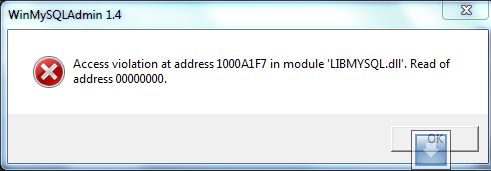

I am working on a project on a Windows 7 machine with XAMPP installed. The version installed was 1.7.0 and it was showing dialog boxes with the following error:

> Access violation at address xxxxxx in module 'LIBMYSQL.dll'. Read of address 00000000

Here is one:  

I tried reinstalling, but reinstallation failed because apparently mysql\\bin folder was not remove during the uninstallation. So, I stopped the winmysqladmin.exe from the task manager and removed the bin folder and reinstalled again.

Then, I was able to install XAMPP. The new version of WinMySQLAdmin does not seem to have the same problem.
