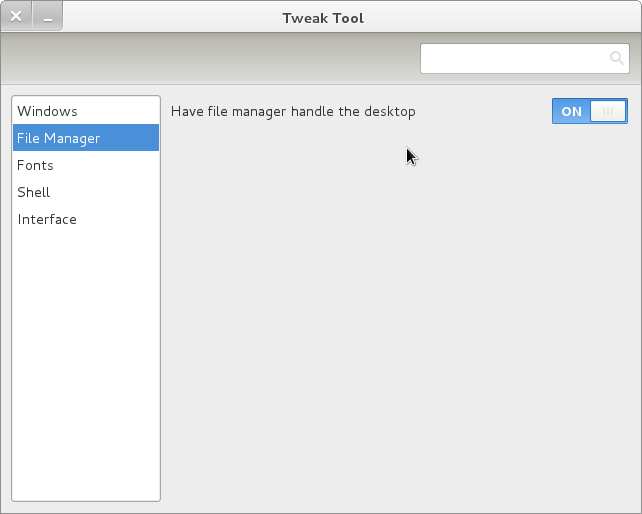

In Fedora 15, nautilus does not handle the desktop by default, nor can you right click on the desktop to bring up the menu. To enable this, install gnome-tweak-tool by using Add/Remove Software. Then, launch it and click on File Manager and then change "Have File Manager handle the Desktop" to "on".

  
The changes take place instantly.

Hope this helps.
