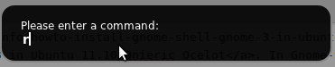

I have just [installed Gnome 3 in Ubuntu 11.10 Onieric Ocelot](http://www.khattam.info/howto-install-gnome-shell-gnome-3-in-ubuntu-11-10-oneiric-ocelot-2011-10-22.html). In Gnome-Shell interface, there are no title bar controls for minimize, maximize/restore. To enable them, open up the terminal and type in (or copy/paste) the following command:

gconftool-2 --set /desktop/gnome/shell/windows/button\_layout --type string close,minimize,maximize:

Now, press Alt+F2, type in "r" without quotes and press enter. This will reload Gnome-Shell and the changes will come into effect.

Note: The above will set the buttons in left side as in Ubuntu default theme (or Mac OS X). To place them in the right (like Gnome 2 default, Windows), use the following command instead:

gconftool-2 --set /desktop/gnome/shell/windows/button\_layout --type string :minimize,maximize,close

Hope this helps.
