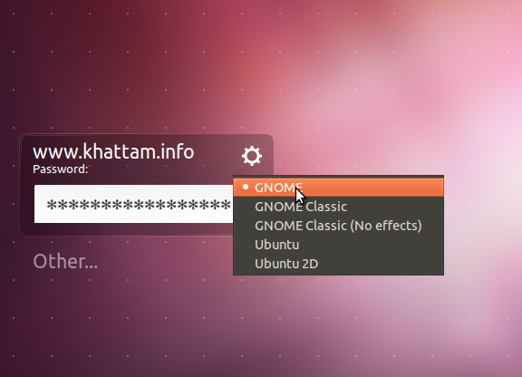

I have installed Ubuntu 11.10 Oneiric Ocelot on my laptop. I had been using Ubuntu 11.04 Natty Narwhal on it and since I use this PC for work, I was reluctant in installing Gnome-Shell from PPA. But since Gnome-Shell is available in official repositories, I decided to give it a go. To install, just open Ubuntu Software Center, search for Gnome-Shell and click "Install". After installation is complete, log out and when logging back in, select Gnome (see screenshot below).

