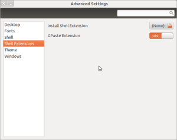
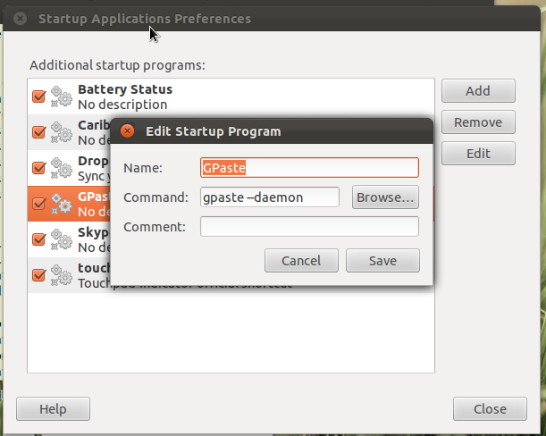

I am a programmer and I can't do without a clipboard manager. If you have never used a clipboard manager before, you don't know what a great tool you are missing. GPaste is an excellent clipboard tool for Gnome-Shell, however it is neither available in Ubuntu repository, nor in any PPA (as of now). Here is how you can compile it. Open up the terminal and get going.

**Install Dependencies**

sudo apt-get install libgtk-3-dev libglib2.0-dev intltool automake autoconf valac git libdee-dev gnome-tweak-tool

**Download Source**

cd; git clone https://github.com/Keruspe/GPaste.git

**Compile and Install**

cd;cd GPaste
./autogen.sh
./configure --prefix=/usr
make
sudo make install

**Restart Gnome-Shell**  
To restart, press Alt+F2, enter ‘r’ (without quotes) and press enter.

**Enable GPaste Extension**  
To enable extension, open up Alt+F2>gnome-tweak-tool (or Activities>Applications>Other>Advanced Settings) and enable GPaste under Shell Extensions.

You should now see GPaste icon in the top panel. However, it may give the following error message:

> (Couldn't connect to GPaste daemon)

For this, add the GPaste daemon in startup as "gpaste --daemon" in StartUP applications and reboot.  

