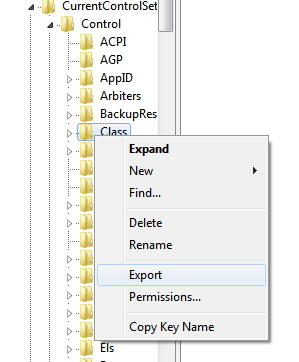
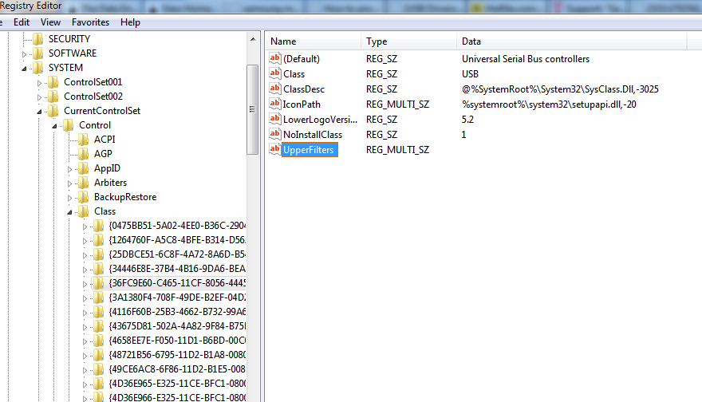
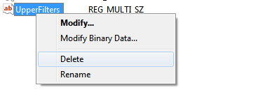

While trying to connect Samsung Galaxy S3 i9300 with Android 4.0 Ice Cream Sandwich on Windows 7 64bit PC with Kies installed, the device driver installation failed and it showed "The device cannot start" in Device Manager. While searching for a fix, I found a [XDA developer forum post](http://forum.xda-developers.com/showthread.php?t=1797344) offering a solution for this issue however, the fix didn't work but thanks to the thread, I finally managed to get it working. I'm sorry but I don't know how it works and why it works and the procedure involves editing registry so proceed with caution. Having said that, here is what you can do to get it to work.

**Prerequisite:**  
Before continuing with the procedure, make sure you have the latest drivers for Samsung device. To do that, connect your device, wait for it to fail and then open Windows Update and click Check for Updates. If you find any Samsung driver update, install it and restart if you have to.

Here is the process:  
1\. Open Registry editor (`regedit.exe`)  
2\. Navigate to the following key and perform a backup by right clicking on it and selecting Export and save anywhere:  
`HKEY_LOCAL_MACHINE\SYSTEM\CurrentControlSet\Control\Class`  

  
This step is a safety measure. You can restore the settings by double clicking the reg file if something goes wrong.  
3\. Now, under Class, find the following keys and look for UpperFilters on the right pane:  
`{36FC9E60-C465-11CF-8056-444553540000}`  
`{EEC5AD98-8080-425f-922A-DABF3DE3F69A}`  

  
If you find UpperFilters, just right click on it and select Delete to delete it.  

  
Remember to do it for both keys i.e. `{36FC9E60-C465-11CF-8056-444553540000}` and `{EEC5AD98-8080-425f-922A-DABF3DE3F69A}`.  
4\. Now, disconnect your phone if you have it connected and try reconnecting.

Hope it works for you too. If it doesn't or if you mess something up, you may want to restore your registry by double clicking the reg file backed up in step 2 and look for some other solution.

Best of luck.
